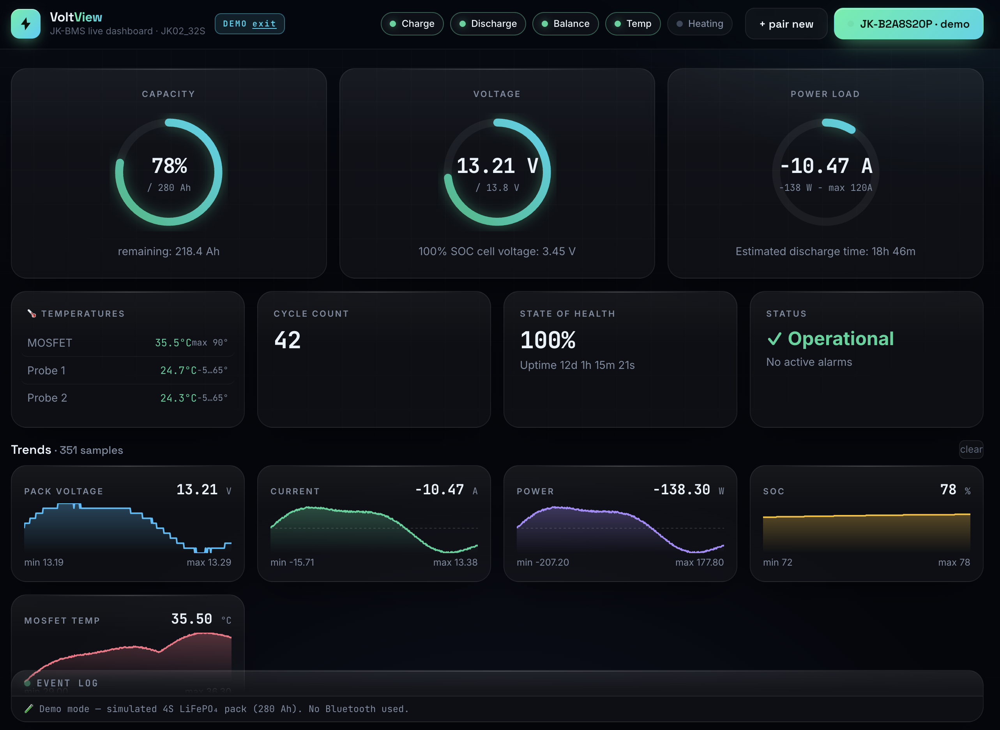
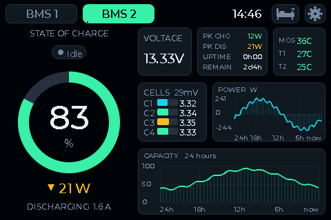
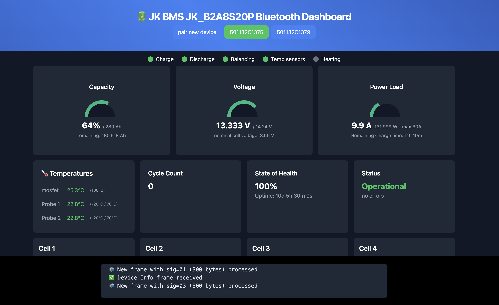
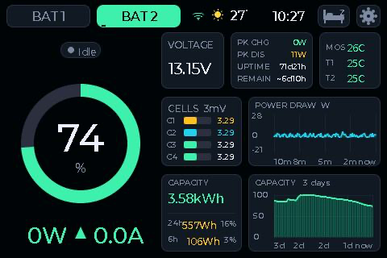

# ⚡ JK BMS — dashboards & firmware

Monitor and control **JK-BMS** battery systems (LiFePO₄ / Li-ion) — over **Bluetooth** from
your browser, or with a standalone **ESP32 touchscreen** wired to the BMS. Everything runs
locally; nothing leaves your network. **One or two packs** are supported everywhere.

This repo ships **three apps** that all speak the JK protocol:

| # | App | Runs on | Link to BMS | Best for |
|---|-----|---------|-------------|----------|
| 1 | 🌐 **Web Bluetooth dashboard** | Any Chromium browser | BLE | Quick check from a phone/laptop, no hardware |
| 2 | 📟 **ESP32 firmware — LVGL** | Guition JC3248W535 touchscreen | RS485/UART | A permanent, polished panel + web app, OTA & **Home Assistant (MQTT)** |
| 3 | 📟 **ESP32 firmware — Arduino_GFX** | same board | RS485/UART | The lighter/faster original build |

<p align="center">


</p>
<p align="center"><em>Left: the Web Bluetooth dashboard (demo mode). Right: the LVGL touchscreen firmware, captured live from the device framebuffer.</em></p>

---

## 🛒 Hardware you need

The Web Bluetooth dashboard (app 1) needs **no hardware** — just a browser. For the ESP32 touchscreen
builds (apps 2 & 3) you need:

| | Part | What to get | Buy |
|---|------|-------------|-----|
| 📟 | **Display board** | Guition **JC3248W535** — ESP32-S3-N16R8, 3.5″ 320×480 QSPI touch | **[AliExpress](https://nl.aliexpress.com/item/1005008495512979.html)** |
| 🔋 | **BMS** | A **JK-BMS** with an **RS485** port (LiFePO₄ / Li-ion) | **[AliExpress](https://nl.aliexpress.com/item/1005008215378422.html)** |
| 🔌 | **Buck converter** | Step the pack voltage down to a clean **5 V** for the board | **[AliExpress](https://nl.aliexpress.com/item/1005006537133858.html)** |
| 🧵 | **Connector cables** | **4-pin** (RS485) and **8-pin** cables to tap the JK-BMS port | **[AliExpress](https://nl.aliexpress.com/item/1005007277110532.html)** |

Full wiring + setup notes in [Recommended hardware](#-recommended-hardware) below.

---

## 1 · 🌐 Web Bluetooth dashboard  (`index.html`)

A single-file, zero-install dashboard that talks to a JK-BMS directly over **Web Bluetooth** —
no app, no build step, no account, no cloud.

- **Live**: SOC / voltage / power ring gauges, per-cell voltages & resistances (min/max
  highlighted), temperatures, cycles, SOH, operational/alarm status.
- **Trends**: rolling sparklines (V, A, W, SOC, MOS temp), session energy (Wh in/out, peaks).
- **Control**: nearly every protection setting & switch is writable (MOSFETs, balancer,
  OVP/UVP, OCP/OTP/UTP …) — each write bounds-checked and confirmed.
- **Multi-pack**: connect several BMSes at once and switch instantly; auto-reconnect.
- **Dev tool**: paste a captured frame hex dump to decode it offline and verify CRC.

<p align="center"></p>
<p align="center"><em>Two packs paired at once.</em></p>

**Run it** (Web Bluetooth needs a *secure context* — `localhost` counts, so no HTTPS needed):
```sh
python3 -m http.server 8765 --bind 127.0.0.1
# open http://127.0.0.1:8765/ in Chrome or Edge, click "pair new"
```
> Try it with no hardware: open `…/?demo=1` (add `&cells=8` / `&packs=2` to preview any setup).
> Web Bluetooth is **not** supported in Firefox or Safari.

---

## 2 · 📟 ESP32 touchscreen firmware — LVGL  (`esp32-bms-lvgl/`)

The flagship build: a permanent panel that reads the BMS over its wired RS485/UART and shows
everything on a 3.5″ touchscreen — **plus a built-in web app and over-the-air updates**.

<p align="center"></p>

- **Live dashboard**: SOC ring gauge, big W·A readout with charge/discharge arrow, status pill
  (Charging / Discharging / Full / Idle / Balancing / FET-off / Alarm — from the BMS's real
  state), voltage / peaks / temps tiles, per-cell bars, a **power-draw graph** (10-min window)
  and a **capacity panel** (total kWh + energy used in the last 24 h / 6 h, with %).
- **Two packs**: auto-switching tabs; both polled every second.
- **Editable settings** written back to the BMS: capacity, cell count, current limits, cell
  OVP/UVP, SOC calibration, balancing, charge profile, temperature protections — via an
  on-screen numeric keypad, each write read-back-verified.
- **Settings**: BMS / WiFi / System tabs, on-screen WiFi keyboard, power-save (auto-dim /
  -sleep / eco), selectable no-data "idle" screens, boot/sleep animations.
- **📶 Built-in web portal** at `http://<device-ip>/` — a responsive dashboard mirroring the
  screen, with **controls**, the full **editable settings**, a **live screenshot** of the LCD,
  and **firmware update**. Password-protected (HTTP Digest).
- **🏠 Home Assistant**: optional **MQTT** with **auto-discovery** — each pack shows up
  automatically as a device with SOC / voltage / current / power / temps / health / cycles /
  status sensors plus Charge / Discharge / Balancer switches. Configure the broker in the web
  portal's *Home Assistant (MQTT)* card; no YAML needed.
- **🔄 OTA**: update over WiFi from the browser *or* PlatformIO — **no cable** after the first flash.

See **[esp32-bms-lvgl/README.md](esp32-bms-lvgl/README.md)** for the deep dive (rendering
pipeline, protocol map, web portal, OTA).

---

## 3 · 📟 ESP32 touchscreen firmware — Arduino_GFX  (`esp32-bms/`)

The original build, drawn directly with **Arduino_GFX** (bitmap fonts, no LVGL pipeline) —
lighter and faster, fewer features. Same board and wiring as the LVGL build. A good base if
you want maximum headroom or to port the dashboard elsewhere.

---

## 🔌 Recommended hardware

| Part | Notes |
|------|-------|
| **Display board** | **Guition JC3248W535** — ESP32-S3-N16R8, 3.5″ 320×480 QSPI (AXS15231B) capacitive touch. Both firmware builds target this exact board. 👉 **[Get it on AliExpress](https://nl.aliexpress.com/item/1005008495512979.html)** |
| **BMS** | Any JK-BMS with an **RS485 port** (e.g. JK-B2A8S20P). Set its protocol to **"JK BMS RS485 Modbus", 115200 baud**. 👉 **[Get it on AliExpress](https://nl.aliexpress.com/item/1005008215378422.html)** |
| **Wiring** | BMS RS485/UART → ESP32. Defaults: **BMS1** RX `IO18` / TX `IO17`, **BMS2** RX `IO15` / TX `IO16`, shared GND. Pins are configurable in Settings → BMS. A **[4-pin (RS485) + 8-pin cable set](https://nl.aliexpress.com/item/1005007277110532.html)** makes tapping the JK port easy. |
| **Power** | 5 V to the board, e.g. via a **[buck converter](https://nl.aliexpress.com/item/1005006537133858.html)** stepping down the pack voltage. ⚠️ Powering from a buck converter often disables the USB **data** port — flash over USB from a PC, then run from the buck. For switched installs, prefer **high-side** switching. |
| **Web dashboard** | A Chromium browser (Chrome/Edge) with Web Bluetooth — nothing else. |

> ⚠️ Always verify your own wiring and never connect VBAT to a logic pin. Set the JK's RS485
> protocol correctly or the device won't read it.

---

## 🚀 Getting started

### Web dashboard (fastest)
1. `python3 -m http.server 8765 --bind 127.0.0.1`
2. Open `http://127.0.0.1:8765/` in Chrome/Edge → **pair new** → pick your BMS.
   (Or `…/?demo=1` to explore with simulated data.)

### ESP32 firmware
1. Install **[PlatformIO](https://platformio.org/)** (CLI or the VS Code extension).
2. Clone this repo.
3. First flash over USB:
   ```sh
   cd esp32-bms-lvgl      # or esp32-bms for the original
   pio run -t upload
   ```
4. On the device: **Settings → WiFi** → connect your network. **Settings → BMS** → set
   **Batteries** (1 or 2) and the **UART pins**; make sure the JK's protocol is **RS485 Modbus**.
5. Open the web portal at **`http://<device-ip>/`** (login `admin`; the password is shown on
   the device's **System Info** screen — a unique per-device default, changeable in the portal).
6. **Updates from now on are wireless** — no cable:
   - **Browser:** portal → *Firmware update* → pick `firmware.bin` (`.pio/build/jc3248w535/firmware.bin`).
   - **PlatformIO:** `pio run` then upload via `espota` to the device IP (hostname `jkbms`).

### Single vs. dual pack
Default is **one** pack. For two, set **Settings → BMS → Batteries → 2** (on the device) and
wire the second pack to BMS2's pins. The dashboard, tabs, web portal and API all adapt to the
count automatically.

---

## License
© 2025–2026 Gillis Haasnoot
